# Exercise 1: Writing your first OAS Document

In this exercise, you will learn what Swagger/OpenAPI is and how you can leverage the specification to design your APIs from scratch. You will start by analyzing a simple use case, and you'll use it to define (roughly) how you want our API to be. Then, you'll move to a web-based tool that not only will help us to write the API definition, but will also give us a lot of goodies for free that will allow our consumers to understand and test our API even if the real implementation does not exist. Finally, you will talk about the next steps of the API creation lifecycle and how you can use what you did to speed up the entire process.

But before going further, we need to address the elephant in the room, **what is Swagger, OpenAPI and OAS?**

## What is Swagger/OpenAPI/OAS

Swagger is an open source software framework backed by a broad ecosystem of tools that helps developers design, build, document, standardize and consume [RESTful Web services](https://en.wikipedia.org/wiki/Representational_state_transfer). While most users identify Swagger by the Swagger UI tool, the Swagger toolset includes support for automated documentation, code generation, and test case generation.


In November 2015, the [Open API Initiative](https://www.openapis.org/) was created with the sponsorship of the Linux Foundation with the goal of standardizing how to describe REST APIs. A variety of companies, including Google, IBM, Microsoft, and MuleSoft are current members of this Collaborative Project. On January 2016 **the Swagger specification was renamed to OpenAPI Specification**, and was moved to a new repository in GitHub. While the specification itself was not changed, this renaming signified the split between the API description format and the open source tooling. As of July 2017, Swagger tools are downloaded over 100,000 times per day, according to hosting repositories Sonatype and NPM.


> **Note:** The specification, as well as other information, is stored in GitHub. The current active version of the spec is **3.0.2**, but for this workshop **we are going to use OpenAPI 2.0** because the tools we'll use were not yet updated to v3. You can find the full documentation of the specs here:
>
> - [OpenAPI 2.0 specs](https://github.com/OAI/OpenAPI-Specification/blob/master/versions/2.0.md) (the version you are going to use in this workshop)
> - [OpenAPI 3.0 specs](https://github.com/OAI/OpenAPI-Specification) (the current active version)

## The scenario

We were asked by the NodeConf organizers to create an API for the conference this year, that might potentially be used by all NodeConf conferences in the world. The team consists of a backend and frontend developers scattered across the globe. The NodeConf organizers want us to make everything we do open source and well documented, allowing anyone to help the dev team at any time with little help.

The use cases that we need to support in this initial version are:

- Retrieve the list of speakers of a specific conference.
- Retrieve the list of activities of a specific conference, that may have one or more speakers.
- Retrieve the agenda of the current conference, composed of one or more activities.
- Finally, have the ability to provide feedback to any activity.

## Steps

### Create your first OAS document in SwaggerHub

SwaggerHub is the official design tool for Swagger documents that help you to write APIs according to specification-based standards. This open source tool provides a lot of features in its free tier that you are going to use throughout this workshop:

- A web-based editor with autocomplete capabilities that will guide you in the process of defining your API.
- Real-time autogenerated API documentation that will help others to understand what your API does.
- An _API Auto Mocking integration_ that will simulate the responses of a real service implementing your API definition.

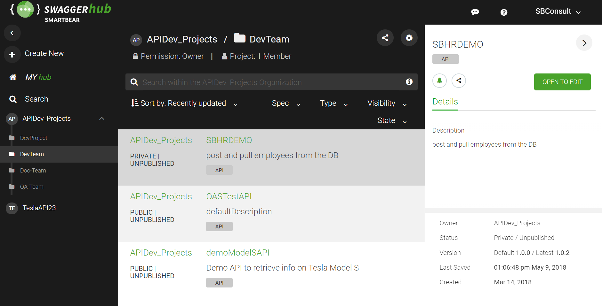

> **Note:** In addition to the free tier, SwaggerHub offers two more subscriptions that provide extra capabilities more suited for teams and enterprises, like collaboration, source control sync, domain management, customer support, etc. You can find more info about this [here](https://swagger.io/tools/swaggerhub/pricing/).

In this section, you are going to use SwaggerHub to create the skeleton of your first Swagger/OAS document in your own personal account.

1. Open a new browser tab and navigate to the Swagger's online editor, [SwaggerHub](https://app.swaggerhub.com/).
1. Use the buttons at the top right to either create a new account associated with your GitHub profile or log in to an existing account.

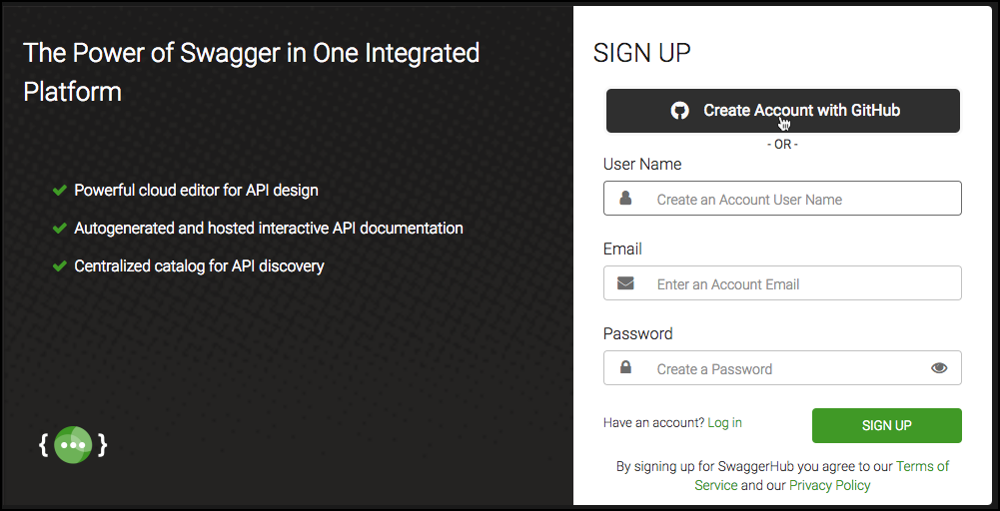

1. After logging/signing in, you will be redirected to **Your hub** page. In the left panel, click the **Create New** button and select **Create new API**.


1. The **Select a Template or create a Blank API** modal will appear. Enter the following information and then click **Create API**.

   - OpenAPI version: `2.0`
   - Template: `-- None --`
   - Name: `nodeconf-api`
   - Version: `1.0.0`
   - Title: `NodeConf API`
   - Description: `This is the API for the NodeConf`
   - Visibility: `Private`
   - Auto Mock API: `ON`
   - Owner: <your-user>.

   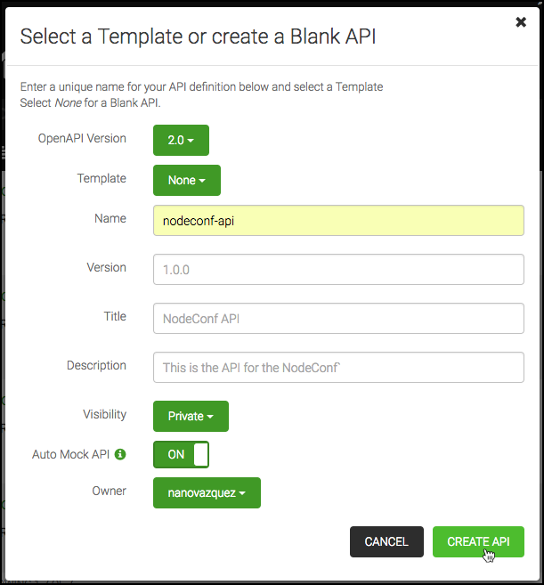

   > **Note:** _Why Swagger 2.0?_ The current active version of the OpenAPI spec is **3.0.2**, but for this workshop **we are going to use OpenAPI 2.0** because the tools we'll use were not updated to v3 yet.

SwaggerHub will now use the information you filled in to create the initial the skeleton of your API definition, and then it will redirect you to the **Design View** of your newly created API definition (or OpenAPI document, both terms are equivalent).


This private and unpublished API description contains the Swagger version and other basic information of your API. There is other stuff autogenerated by the _API Auto Mocking integration_, but you'll see what this does later in the exercise.

Finally, notice that the `paths` property has an empty object (`{}`). In the next sections, we are going to replace this object with some real paths.

## Implement your first OAS document

In the initial section of this exercise, we described the initial use cases we have to support. Let's do a quick recap:

- Retrieve the list of speakers of a specific conference.
- Retrieve the list of activities of a specific conference, that may have one or more speakers.
- Retrieve the agenda of the current conference, composed of one or more activities.
- Finally, have the ability to provide feedback to any activity.

As you might have figured out at this point, these use cases define some clear entities your consumers will have to interact with, like _Speaker_, _Activities_ and _Agenda_. And some actions your API need to support for this, like retrieving these entities or sending new _Feedback_. We can model all of these interactions by using a [REST architecture](https://en.wikipedia.org/wiki/Representational_state_transfer) for our API. Using it, we can start defining some key aspects of our API:

- It needs a path that accepts a **GET** action to return a collection of **Speakers** in a **JSON** format, along with a **200** status code.
- Similarly, it needs a path to retrieve **Activities** to generate the agenda.
- If you want to use this API for more than just a conference, users need to be able to identify what conference they are targetting to. There are several ways to do this, being the most common the inclusion of the conference ID as part of all paths. For simplicity, you would use the year of the conference as its ID. And you will use **edition** to allow any event, not only conferences.
- Last, it needs a path to receive **Feedback** of activities. This path should allow **POST** actions containing information in the body with the user's opinion.

> **Note:** if you haven't heard about REST or you are still getting familiarized with it, we recommend you to read [this](https://www.restapitutorial.com/) tutorial.

With these ideas in mind, let's start updating our OAS document:

### Retrieve the list of Speakers

1. First, you are going to add the **path** to retrieve the speakers of the conference, that will also contain the _editionId_ parameter. Parameters are surrounded by curly braces to identify pieces of a path that will have a different value at runtime. This technique is known as _parameter templating_. To do this, replace the empty object in the `paths` key with the following:

   ```
   paths:
      /editions/{editionId}/speakers:
   ```

   > **Note:** Path templating refers to the usage of curly braces ({}) to mark a section of a URL path as replaceable using path _parameters_. In this case, users will call to `/editions/2018/speakers` to get the Speakers collection of the year 2018.

1. Next, you need to define the shape of the **parameter** endpoint will use. Since we are going to use a **path** parameter, we need to define a _name_, which must correspond to the associated path segment in the path field, its type (`path`) and if it's required or not. Paste the following code below the path you added in the previous step:

   ```
   paths:
     /editions/{editionId}/speakers:
       parameters:
       - name: editionId
         in: path
         description: Year of the hosted edition
         required: true
         type: string
   ```

   > **Note:** you can define parameters in your _path_, _query_, _body_ and _formData_. You can learn how to configure all of them by navigating [here](https://github.com/OAI/OpenAPI-Specification/blob/master/versions/2.0.md#parameter-object).

1. Now you need to add the actual **operation** that will be used to retrieve the Speakers, as all paths support many (REST) operations. Below the _parameter_ definition, add a **GET** operation with a summary explaining what it does, as shown in the code snippet below:

   ```
   paths:
     /editions/{editionId}/speakers:
       parameters:
         ...
       get:
         summary: Retrieves the speakers
   ```

> **Note:** If you want to learn more about _operations_ and their configurations, see [here](https://github.com/OAI/OpenAPI-Specification/blob/master/versions/2.0.md#operationObject).

1. Define the available response formats of this operation by adding [MIME types](https://developer.mozilla.org/en-US/docs/Web/HTTP/Basics_of_HTTP/MIME_types) in the **produces** array. The scenario defines that the API only needs to support `application/json`. Let's add only this value for now:

   ```
   paths:
     /editions/{editionId}/speakers:
       parameters:
         ...
       get:
         summary: Retrieves the speakers
         produces:
           - application/json
   ```

1. Next, define the different responses this operation can retrieve. [REST defines several response types](https://restfulapi.net/http-status-codes/), identifying each one of them with a **status code**. You should define all possible responses your operation could return, but to fulfill the requirements of this exercise only define a single **200 (OK)** response type in this operation. Don't forget to add a description explaining what it does:

   ```
   paths:
     /editions/{editionId}/speakers:
       parameters:
         ...
       get:
         summary: Retrieves the speakers
       responses:
         200:
           description: A list of speakers of the edition
   ```

   > **Note:** You can find more information about the **responses** object [here](https://github.com/OAI/OpenAPI-Specification/blob/master/versions/2.0.md#responses-object).

1. Every response has a structure. It can be a primitive, an array, an object or even an empty value. Swagger/OAS use the **schema** property to define the structure of the response. You can specify these structures inline, but this will make the operation harder to read, as these responses are usually complex. Instead, you can also use the **$ref** field to reference any internal or external section of a Swagger/OAS document.

   ```
   paths:
     /editions/{editionId}/speakers:
       parameters:
         ...
       get:
         summary: Retrieves the speakers
         responses:
           200:
             description: all speakers of the edition
             schema:
               type: array
               items:
                 $ref: '#/definitions/Speaker'
   ```

   > **Note:** Learn more about the Reference object [here](https://github.com/OAI/OpenAPI-Specification/blob/master/versions/2.0.md#reference-object).

1. SwaggerHub will complain about the missing _Speaker_ definition in your API document. What you need to do next is to add a new **definitions** property in the root of your document containing the definition of the _Speaker_ object, with the following properties: _id_, _name_, _description_, _imageUrl_, _githubAccount_ and _twitterAccount_:

   ```
   swagger: '2.0'
   info:
     ...

   paths:
     ...

   definitions:
     Speaker:
       type: object
       required:
         - id
         - name
         - description
         - imageUrl
         - githubAccount
         - twitterAccount
       properties:
         id:
           type: string
           format: uuid
           example: d290f1ee-6c54-4b01-90e6-d701748f0851
         name:
           type: string
           example: John Doe
         description:
           type: string
           example: Node JS Developer
         imageUrl:
           type: string
           format: uri
           example: http://some.image.com/image.png
         githubAccount:
           type: string
           example: '@i-am-a-developer'
         twitterAccount:
           type: string
           example: '@john-doe'
   ```

   > **Note:** inside the _definition_ you can add any data type that follows the [Schema Object specification](https://github.com/OAI/OpenAPI-Specification/blob/master/versions/2.0.md#schemaObject).

1. If everything is OK, you should see no error in SwaggerHub. What's more, you should see the following sections in your browser:

   - In the left panel, the list of available _Paths_ and the _Models_ defined in your API document.
   - At the top of the right panel, the description of your API.
   - At the bottom of the right panel, detailed information of the _Paths_ and the **Try it out** button.

   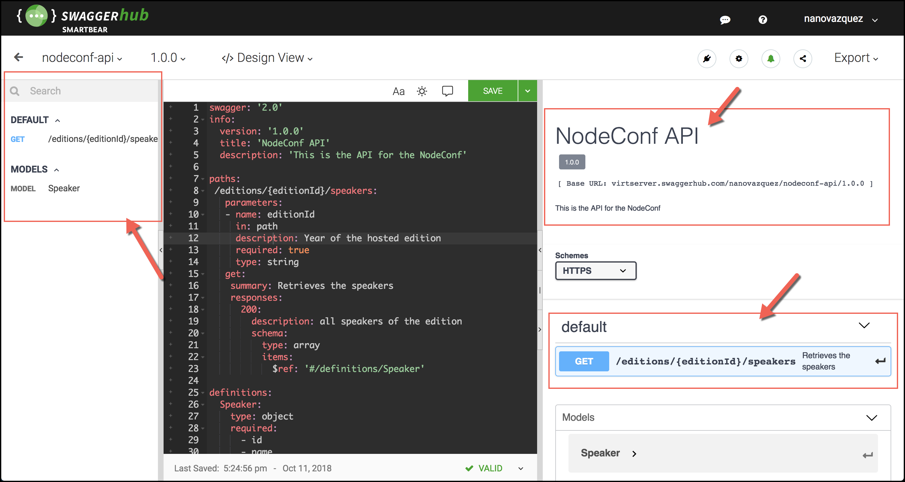

1. Finally, click the green **Save** button to test your newly created endpoint.

#### Test the endpoint

Even with a basic definition of the endpoint, you can use the **Try it out!** functionality to test how it would behave and/or get early feedback of your design before it is implemented. This functionality leverages the **API Auto mocking integration** in your API (the autogenerated code at the bottom) to return a response mock based on the examples you defined in your API document.

It is even useful to allow developers to start building client applications even before the API backend is ready.

> **Note:** You can learn more about the _API Auto mocking integration_ [here](https://app.swaggerhub.com/help/integrations/api-auto-mocking).

1. In the right panel of your API, click the **/editions/{editionId}/speakers** row to expand it.
1. Now, click the **Try it out** button. Notice that a field will appear below _Year of the hosted edition_.
1. In this new field, enter any value for the **editionId**. For instance, use `2018`.
1. Finally, click the **Execute** button.
1. Scroll down to visualize the output. You will see a section containing the cURL that will auto update every time you change the field values.

   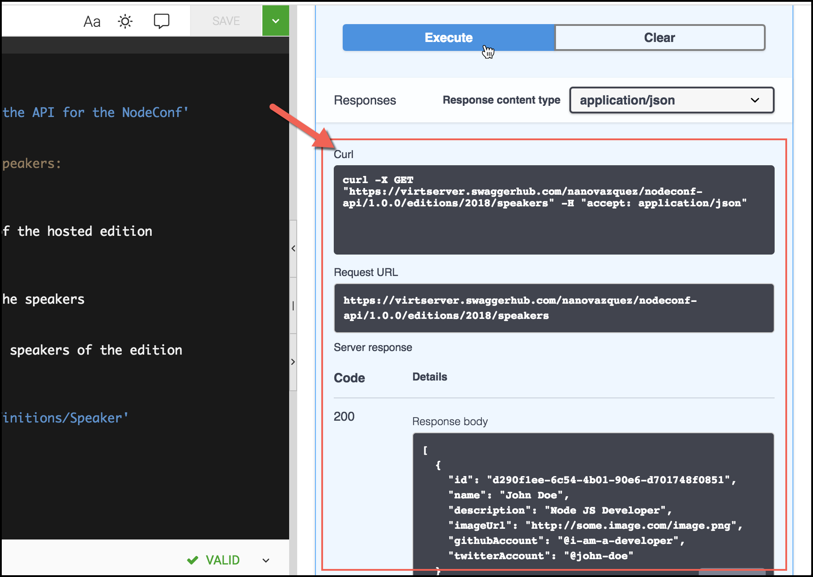

Thanks to the _API Auto mocking_, you could use both the cURL snippet or the Request URL to make calls to your API and get a result. Once you have validated this path, move to the next section and create new ones.

### Retrieve the list of Activities

You now need to create a path to retrieve the **Activities** of the conference. Each activity has a name, a brief description, its type (talk, workshop, break, etc.) and its speaker/s. Finally, we are going to add a way to send information to search for activities by its type or its day.

1. First, add the model of the activities in our OAS document. For this, scroll down to the **definitions** field and paste the following snippet that defines the shape of the **Activity** object.

   Notice two things:

   - This time we define three fields as _required_.
   - One of the fields expects an array of _Speakers_. We are going to use a **$ref** to reuse the definition of this entity.

   ```
   definitions:
     Speaker:
       ...
     Activity:
       type: object
       required:
         - id
         - name
         - type
       properties:
         id:
           type: string
           format: uuid
           example: d290f1ee-6c54-4b01-90e6-d701748f0851
         name:
           type: string
           example: Design First APIs with OAS
         description:
           type: string
           example: Workshop to learn how to design APIs with Swagger/OpenAPI
         type:
           type: string
           example: workshop
         speakers:
           type: array
           items:
             $ref: '#/definitions/Speaker'
         startTime:
           type: string
           example: "2018-10-18T19:30:00Z"
         endTime:
           type: string
           example: "2018-10-18T20:00Z"
   ```

   > **Note:** For more information about how to define input and output data types, see [this](https://github.com/OAI/OpenAPI-Specification/blob/master/versions/2.0.md#schemaObject).

1. Click the green **Save** button at the top. You should see the new model in the left panel.

   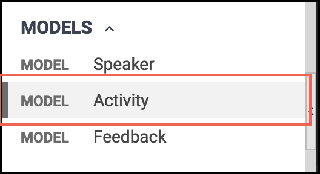

1. Next, go to the **paths** field and add a new endpoint to manage activities. Prepend the `editionId` as before to identify the activities of a particular conference from others:

   ```
   ...
   paths:
     /editions/{editionId}/speakers:
       ...
     /editions/{editionId}/activities:
       parameters:
       - name: editionId
         in: path
         description: Year of the hosted edition
         required: true
         type: string
   ```

1. Add a **GET** operation to retrieve a collection of activities, with a summary explaining what this operation does.

   ```
   paths:
     ...
     /editions/{editionId}/activities:
       ...
       get:
         summary: Searches for activities of an edition
   ```

1. Now, define that this operation could receive query string values that can be used to search activities by day, type, etc. Use the same **parameters** section that we used before, but this time use the **query** type.

   ```
   paths:
     ...
     /editions/{editionId}/activities:
       ...
       get:
         summary: Searches for activities of an edition
         parameters:
         - in: query
           name: searchString
           description: pass an optional search string for looking up activities
           required: false
           type: string
   ```

   > **Note:** Learn more about query parameters by clicking [this](https://github.com/OAI/OpenAPI-Specification/blob/master/versions/2.0.md#parameter-object) link.

1. Next, we need to define that this endpoint returns `application/json`. For this, add this value in the **produces** array field.

   ```
   paths:
     ...
     /editions/{editionId}/activities:
       ...
       get:
         ...
         produces:
         - application/json
   ```

1. And finally, define the response of this operation, an array of activities with a 200 (OK) **status code**. Use the **Activity** schema defined in the previous steps as the **schema** of the items that this endpoint will return.

   ```
   paths:
     ...
     /editions/{editionId}/activities:
       ...
       get:
         ...
         responses:
           200:
             description: A list of activities that meet the search criteria
             schema:
               type: array
               items:
                 $ref: '#/definitions/Activity'
   ```

   > **Note:** The code above takes advantage of the **$ref** feature in Swagger to reduce the amount of information in the path. Learn more about the Reference object [here](https://github.com/OAI/OpenAPI-Specification/blob/master/versions/2.0.md#reference-object).

1. Click the green **Save** button to test your newly created endpoint.

#### Test the endpoint

1. In the right panel of your API, click the **/editions/{editionId}/activities** row to expand it.
1. Click the **Try it out** button. Notice that a field will appear below _Year of the hosted edition_.
1. In this new field, enter any value for the **editionId**. For instance, use `2018`.
1. Finally, click the **Execute** button.
1. Scroll down to visualize the output. You will see a section containing the cURL that will auto update every time you change the field values.

   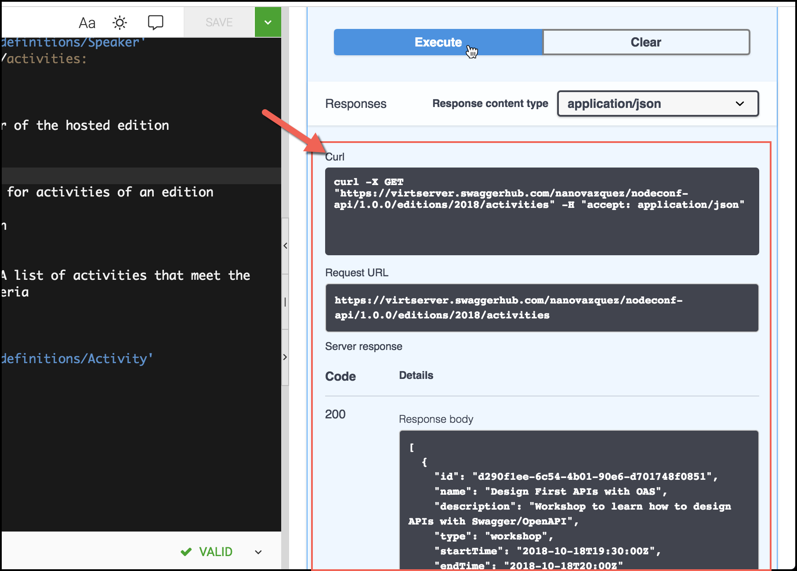

> **Note:** We are using the _API Auto mocking integration_ to test our endpoint even before the API backend is ready. You can learn more about this integration [here](https://app.swaggerhub.com/help/integrations/api-auto-mocking).

### Provide feedback to an Activity

Last, you need to create a path to provide feedback to activities, with a rating that goes from 1 to 5.

1. Go to the **definitions** field and define the **Feedback** model with the following required fields: `id`, `activityId`, `username` and `rating`.

   ```
   definitions:
     ...
     Feedback:
       type: object
       required:
         - id
         - activityId
         - username
         - rating
       properties:
         id:
           type: string
           format: uuid
           example: d290f1ee-6c54-4b01-90e6-d701748f0851
         activityId:
           type: string
           format: uuid
           example: d290f1ee-6c54-4b01-90e6-d701748f0851
         username:
           type: string
           example: John Doe
         rating:
           type: integer
           example: 5
   ```

1. Click the green **Save** button at the top. You should see the new model in the left panel.

   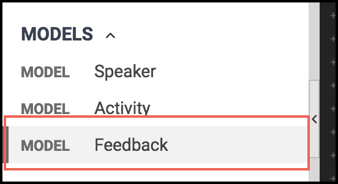

1. Now, add a new **path** for feedback. Unlike the other paths, it will only allow **POST** operations:

   ```
   paths:
     ...
     /editions/{editionId}/feedback:
       parameters:
       - name: editionId
         in: path
         description: Year of the hosted edition
         required: true
         type: string
       post:
         summary: Adds feedback to an activity
   ```

   > **Note:** In REST, you usually use POST operations to create new entities, receiving all the information needed for this in the body of the request. Learn more about REST [here](https://www.ietf.org/rfc/rfc2616.txt).

1. Define that this endpoint will **consume** form's information to create the feedback. And it will **produce** a JSON object representing the newly created feedback object. This combination is pretty common in a POST operation.

   ```
   paths:
     ...
     /editions/{editionId}/feedback:
       ...
       consumes:
         - multipart/form-data
       produces:
         - application/json
   ```

1. Use the **parameters** to define the shape of the form data your API will receive. Notice that now we use `in: formData`, but the rest remains the same.

   ```
   paths:
     ...
     /editions/{editionId}/feedback:
       ...
       post:
         summary: Adds feedback to an activity
         consumes:
           - multipart/form-data
         produces:
           - application/json
         parameters:
           - name: activityId
             in: formData
             description: The ID of the activity
             format: uuid
             required: true
             type: string
           - name: username
             in: formData
             description: Name of the user
             required: true
             type: string
           - name: rating
             in: formData
             description: Rating provided
             required: true
             type: integer
   ```

   > **Note:** Learn more about the Parameters object and how to send form data [here](https://github.com/OAI/OpenAPI-Specification/blob/master/versions/2.0.md#parameter-object).

1. Finally, define the response of this operation, consisted of a **status code** and a **schema**:

   ```
   paths:
     ...
     /editions/{editionId}/feedback:
       ...
       responses:
         201:
           description: The Feedback was received
           schema:
             $ref: '#/definitions/Feedback'
   ```

   > **Note:** You can find more information about the **responses** object [here](https://github.com/OAI/OpenAPI-Specification/blob/master/versions/2.0.md#responses-object).

1) Finally, click the green **Save** button to test your newly created endpoint.

#### Test the endpoint

1. In the right panel of your API, click the **/editions/{editionId}/feedback** row to expand it.
1. Click the **Try it out** button.
1. Fill all the required fields with any value and click the **Execute** button. Notice that the `activityId` field requires a UUID (e.g. `d290f1ee-6c54-4b01-90e6-d701748f0851`).
1. Scroll down to visualize the output. You will see a section containing the cURL that will auto update every time you change the field values.

   

> **Note:** We are using the _API Auto mocking integration_ to test our endpoint even before the API backend is ready. You can learn more about this integration [here](https://app.swaggerhub.com/help/integrations/api-auto-mocking).

## Leverage Swagger capabilities to improve your OAS document

In this section, you will learn some of the most common tweaks in Swagger/OpenAPI to boost your API document. These changes go from reducing its length by reusing pieces of it to add more details to your document that the tooling will pick up and enhance the user experience.

### Reuse parameters in your paths

Your API document uses an `editionId` parameter in the path to retrieve resources of a particular edition. Since all the endpoints defined are tied to a particular edition, you had to define this parameter in all of them. But, as you have seen, you can take advantage of the **$ref** field to reference any internal or external section of a Swagger/OAS document.

1. Create a new **parameter** section at the root level of your API document.
1. Create a new definition for the **editionId** parameter, located in the **path** of your resources.

   ```
   parameters:
     editionId:
       name: editionId
       in: path
       description: Year of the hosted edition
       required: true
       type: integer
   ```

   > **Note:** This _parameters_ field holds information that can be used across operations, but does not define global parameters for any of them, you need to do it manually. For more information about the Swagger/OpenAPI schema, see [this](https://github.com/OAI/OpenAPI-Specification/blob/master/versions/2.0.md#schema).

1. Now, locate the first **path** you created: `/editions/{editionId}/speakers`.
1. Replace the **parameters** section that contains the definition of the parameter with a reference to the newly created definition:

   ```
   paths:
     /editions/{editionId}/speakers:
       parameters:
         - $ref: '#/parameters/editionId'
   ```

1. Repeat the same process in the rest of the paths.

The use of this technique allow us to reduce the length of the API document, especially in each path, increasing its readability.

### Use enums to restrict the possible values

There are certain operations in our API document that have a fixed set of values users could use. In these cases, it is recommended to use **enums** to teach consumers about this by providing a better user experience in your documentation.

1. Go to the **Activity** model in your API document. You can do it quickly by clicking the **Activity model** in the left panel.

   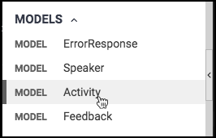

1. Find the **type** property and add a new **enum** field with all the possible activity types: `[talk, workshop, keynote, break, lunch, raffle]`.

   ```
   Activity:
     ...
     properties:
      ...
       type:
         type: string
         example: workshop
         enum: [talk, workshop, keynote, break, lunch, raffle]
   ```

   > **Note:** you could create enums of any type, including `null`. But this field must contain at least one element in the array. For more information, see [this](https://tools.ietf.org/html/draft-fge-json-schema-validation-00#section-5.5.1).

1. Remove the **example** field and then click the green **Save** button at the top.
1. Test this endpoint using the **Try it out!** button in the right panel. Notice that the _API Auto Mocking integration_ will retrieve the first item in the enum.
1. Repeat the same steps for the **rating** property in the **Feedback** object to fix the values between 1 and 5.

   ```
   Feedback:
     ...
     properties:
       ...
       rating:
         type: integer
         enum: [1, 2, 3, 4, 5]
   ```

1. Don't forget to update the **rating** form field in the `/editions/{editionId}/feedback` path:

   ```
   /editions/{editionId}/feedback:
     parameters:
       - $ref: '#/parameters/editionId'
     post:
       ...
       parameters:
         ...
         - name: rating
           in: formData
           description: Rating provided
           required: true
           type: integer
           enum: [1, 2, 3, 4, 5]
   ```

1. Finally, click the green **Save** button at the top and test the feedback path again by clicking the **Try it out** button in the right panel. Notice that the _rating_ field changed to a select component.

   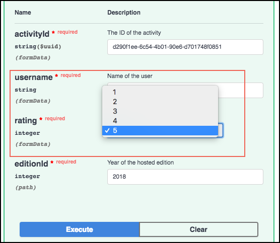

With this subtle change, you make this field crystal clear for the consumers of your API.

### Define default operations in endpoints

The paths you defined were handling a single status code, the happy path. Since you will discover most of the information about your API while implementing it, document every possible outcome is not mandatory. However, it is expected from the consumer point of view to read about the successful operation response and any known errors. Swagger/OpenAPI simplifies the latter by providing a **default** field that maps all uncovered responses.

1. Go to the **definitions** field of your API document.
1. Add a new definition that you will use for error responses.

   ```
   definitions:
     ErrorResponse:
       description: Response containing an error
       type: object
       properties:
         errorMessage:
           type: string
           example: 500 Internal Server Error
   ```

1. Now, add a new **default** field inside the **responses** field of all paths, and reference its schema to the **ErrorResponse** object you have just created. It should look like the following:

   ```
   /editions/{editionId}/feedback:
     parameters:
       - $ref: '#/parameters/editionId'
     post:
       ...
       responses:
         201:
           ...
           default:
             $ref: '#/definitions/ErrorResponse'
   ```

   > **Note:** The `default` field can be used as the default response object for all HTTP codes that are not covered individually by the specification. For more information, see [this](https://github.com/OAI/OpenAPI-Specification/blob/master/versions/2.0.md#responses-object)/

1. Click the green **Save** button.
1. Finally, open the endpoint documentation at the top right and validate that the **default** response is now part of it.

   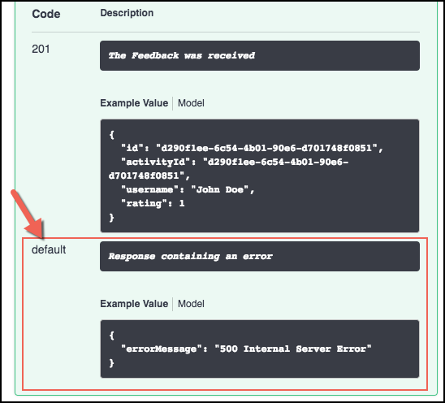

And that's it! If you got lost at any point of the exercise, you could compare your API document with the file located at the end folder of this exercise.

## Test your newly created API

As you did throughout the exercises, thanks to the _API Auto Mocking integration_ you can test the endpoints of your API using **Try it out!** button in the right panel. But this doesn't end here: you can give this information to anyone so they can test your API while you are designing it. Let's see how you could do this:

1. If not open yet, navigate to **SwaggerHub** and open your API.
1. Locate the **Export** drop-down button at the top right of the screen and click it.
1. A popup menu will open with different options you can choose. Click **Download API** and then **JSON Resolved**. A **zip** file will start downloading. Once it's completed, unzip the file.

   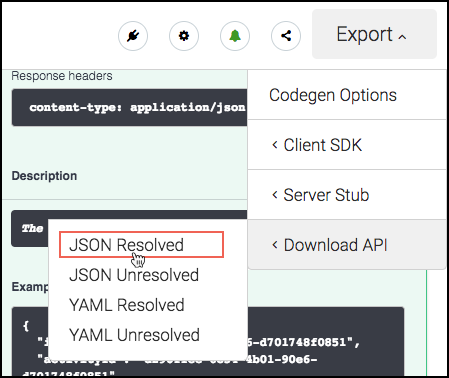

1. Open [Postman](https://www.getpostman.com/) in your laptop (or an equivalent app).
1. In the top left, click the **Import** button and drop the **swagger.json** file located inside the unzipped folder. Once imported, Postman will display a success message at the bottom right.

   

1. You now have a new a collection in Postman that contains all the information needed to query your API. For instance, click the **GET Retrieve the speakers** row in the left panel to create a new tab in Postman with the info needed for this call.
1. Replace the **editionId** param key with `2018` and click the **Send** button. Verify that the response is the same one you get while using the **Try it out!** feature. This is because you are using the same _API Auto Mocking integration_ provided by SwaggerHub.

   

Congratulations! 🎉 You are now ready to move to the next stage: implementing a client app that will consume your API.
